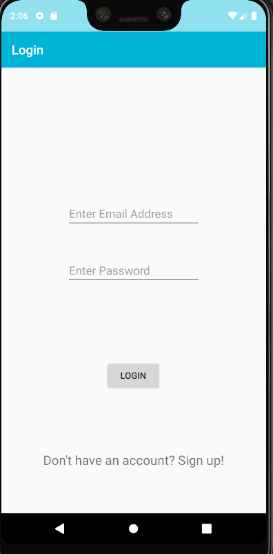
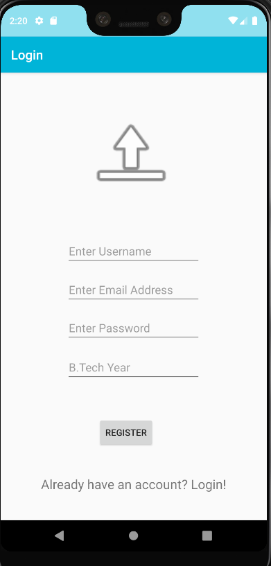
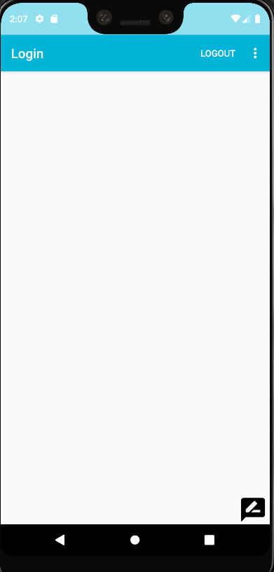
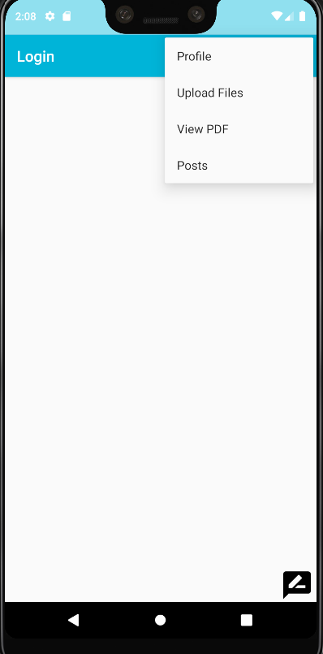
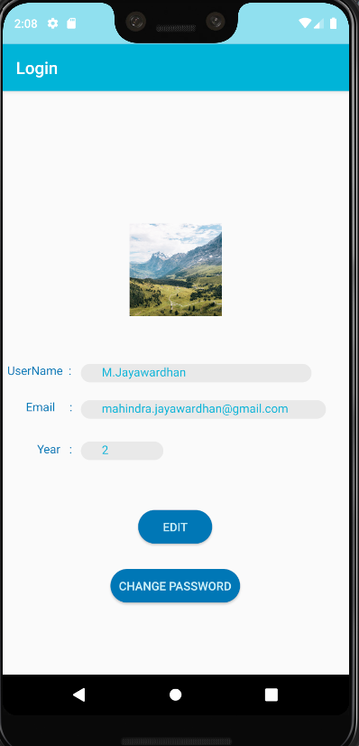
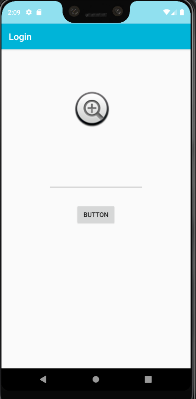
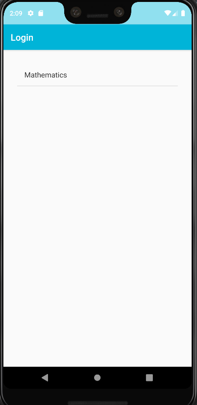
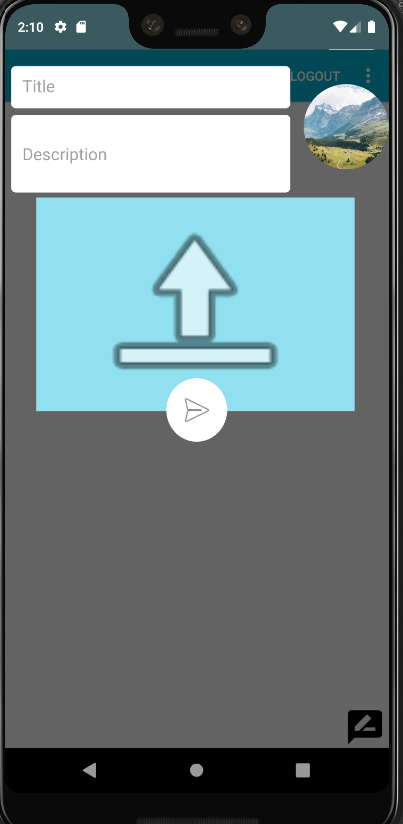
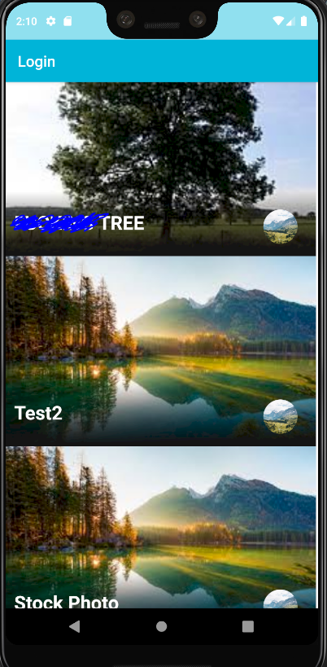
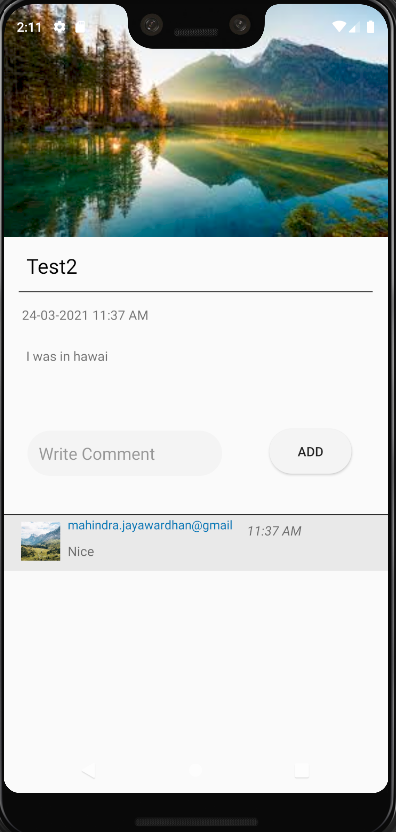

# DynamicSocialMediaApp
This is an prototype of an app that you can use to upload posts and documents and has a dedicated feed that displays the posts

Welcome to the DynamicSocialMediaApp wiki!

This app works on Firebase in terms of both real-time database and cloud storage.

This is the login page. If you don't have an account you can click the sign up option below.
================================================================================================================================

In case you don't have an account you can register and make a new one.
================================================================================================================================

This is the HOME SCREEN. Its still unfinished as I'm working to make it look better
================================================================================================================================

This is the menu in the homescreen through which you can navigate to different activities in the app
================================================================================================================================

This is the profile section. Here you can see your details and also can edit them.
================================================================================================================================

This where you can upload any documents. It still doesn't accept media files but I'm working on it
================================================================================================================================

This page shows the files uploaded and you can open it.
================================================================================================================================

This is the post activity. Here you can share your photos.
================================================================================================================================

This is the dedicated feed for all the posts. You can preview the picture of the post and profile photo of the user who uploaded it along with the post name.
================================================================================================================================

When you click on a post in the feed it brings you to this page. Here you can see the post description, time uploaded and also has a dedicated comments section.
================================================================================================================================
Overall this app is still in development. I'm trying to add more features while refining the pre-existing ones.
